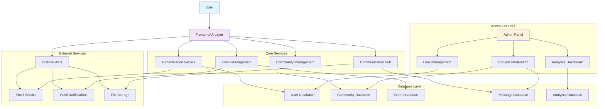

# KommunityKonect

## 🏘️ Connecting Communities to Household Services

KommunityKonect is a comprehensive platform that bridges the gap between residential community members and service professionals. It streamlines the process of submitting, managing, and fulfilling household service requests—from plumbing emergencies to electrical issues and general repairs.

## 🌟 Core Features

### For Residents
- **Request Submission**: Easy-to-use form to submit detailed service requests with descriptions, photos, and urgency levels
- **Service Reports**: AI-powered service reports generated through NVIDIA's DeepSeek model
- **Status Tracking**: Monitor the progress of submitted requests in real-time

### For Service Professionals
- **Job Management Dashboard**: View assigned tasks, update status, and add notes
- **Schedule Management**: Track appointments and availability
- **Notification System**: Receive alerts when assigned new tasks

### For Administrators
- **Centralized Dashboard**: Comprehensive overview of all service requests
- **Assignment System**: Assign tasks to appropriate service professionals
- **Calendar Management**: Schedule and organize service appointments
- **Override Controls**: Emergency tools for manual intervention

## 📊 System Architecture

### User Roles
- **Residents**: Submit and track service requests
- **Service Professionals**: View and fulfill assigned tasks
- **Administrators**: Manage the entire service ecosystem

### Database Structure
The application uses MongoDB with the following collections:
- `users_col`: User accounts and authentication data
- `requests_col`: Service request details and status information

### Notification System
Integrated with Telegram for real-time notifications to service professionals and administrators

### Technology Stack
- **Frontend**: Streamlit
- **Backend**: Python
- **Database**: MongoDB
- **AI Integration**: NVIDIA's DeepSeek model for service report generation
- **Authentication**: Custom hash-based authentication

## 🔄 System Flow

### System Components

- **Frontend/UI Layer**: User interface for community interaction
- **Authentication Service**: User login, registration, and session management
- **Community Management**: Create, join, and manage communities
- **Event Management**: Schedule and organize community events
- **Communication Hub**: Messaging and discussion features
- **Admin Panel**: Administrative controls and monitoring
- **Database Layer**: Persistent storage for all application data
- **External Services**: Third-party integrations for enhanced functionality